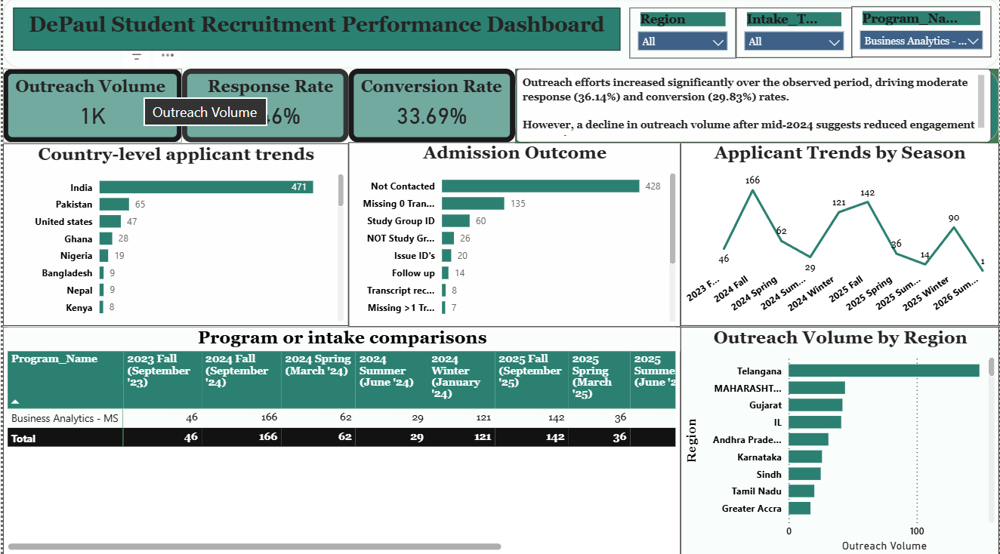
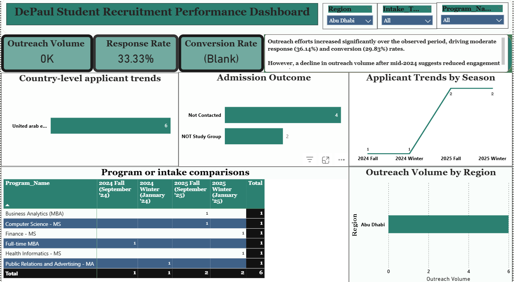
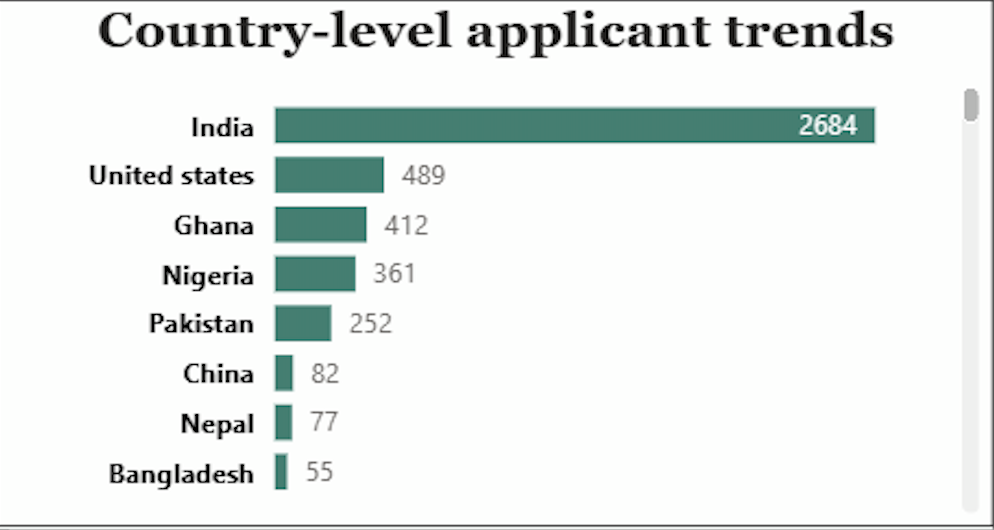
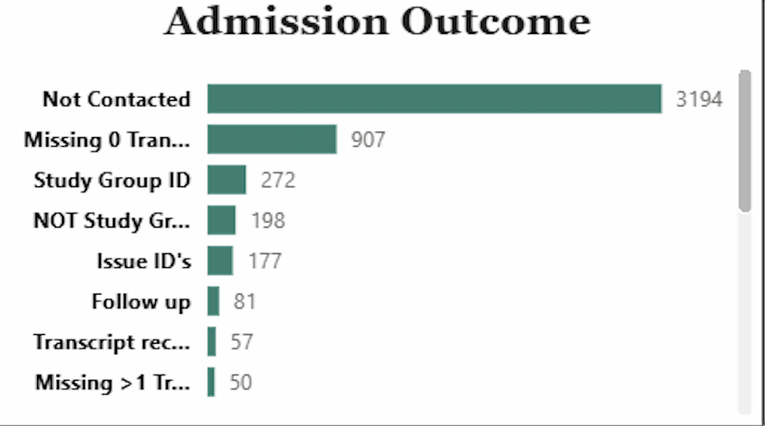
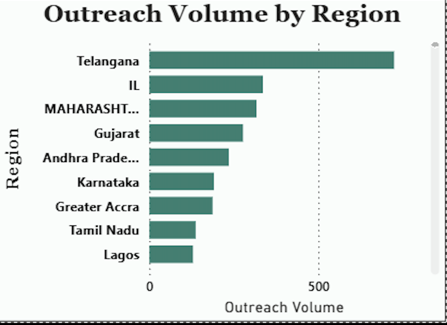
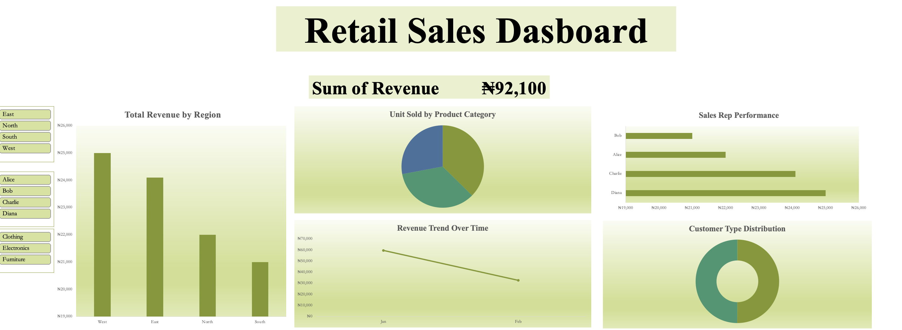

# Kelechi's Data Analytics Portfolio

I am an aspiring Data Analyst with a strong focus on Excel, data cleaning, and data visualization. 

This portfolio showcases my internship work and projects where I analyze data and turn it into meaningful insights.
Hi, I’m building my skills in data analytics and data visualization.

This repository contains my internship work and personal projects where I applied data cleaning, analysis, and dashboard creation.

---

## 📊 Internship – Excelerate

This section contains my weekly deliverables from my 1-month Data Visualization Internship.

### Week 1
- Introduction and initial analysis

### Week 2
- Data cleaning and quality improvement

### Week 3
- Built an interactive dashboard
- Created a design document
- Generated insights and recommendations
### Dashboard Preview
These visuals showcase the interactive dashboard built to analyze applicant trends, program performance, and outreach effectiveness.

### Week 4
- Final report and presentation
- Reflection on learning and growth

---

## 🧠 Skills Demonstrated
- Data Cleaning (Excel)
- Data Analysis
- Dashboard Creation
- Data Visualization
- Business Insights

---

---
---

---

## ⭐ Featured Project: Sales Performance Dashboard

### 📌 Problem
Businesses often struggle to track sales performance and identify trends quickly from raw data.

### 📊 Approach
- Cleaned and structured the dataset in Excel  
- Analyzed sales trends and key performance metrics  
- Built an interactive dashboard for easy visualization  

### 📈 Key Insights
- Identified top-performing periods and sales patterns  
- Highlighted areas with lower performance  
- Made it easier to track KPIs at a glance  

### 🛠 Tools Used
- Microsoft Excel  

### ✅ Outcome
- Created a clear and interactive dashboard  
- Improved visibility into sales performance  
- Enabled better decision-making  

### 📸 Dashboard Preview

  
## 📁 Personal Projects

### Customer Data Cleaning
- Cleaned raw customer dataset using Excel
- Handled missing values, duplicates, and formatting issues
- Documented the data cleaning process

### Retail Sales Trends Analysis
- Analyzed sales trends over time
- Identified patterns based on time and performance
- Generated insights from the dataset

### Sales Performance Dashboard
- Built an interactive Excel dashboard
- Visualized key sales metrics
- Designed charts for easy understanding
